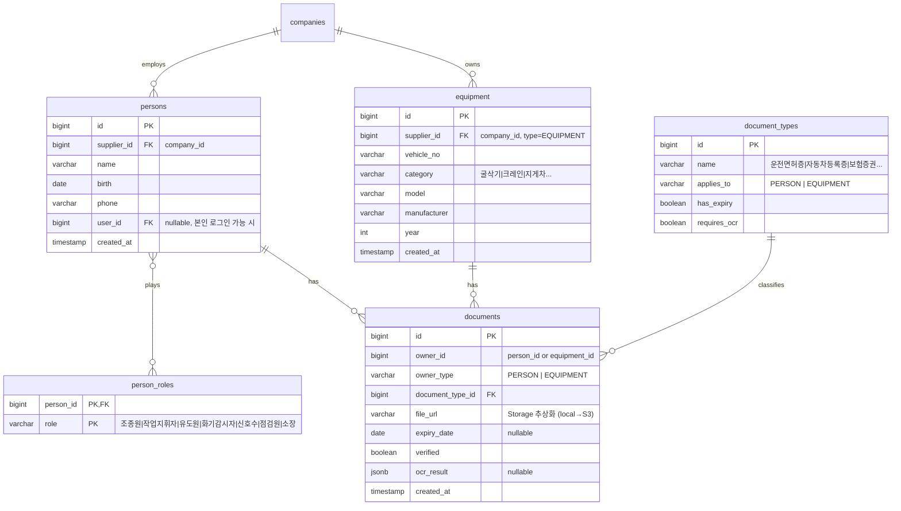

# SKEP v2 ERD

> 마지막 갱신: 2026-05-11 (Phase S-11: document_supplement_requests + document_types 카테고리/역할 매핑)
> 다이어그램은 Mermaid (GitHub에서 자동 렌더). 마이그레이션 SQL: `backend/src/main/resources/db/migration/`

---

## 현재 스키마 (Phase S-3까지)

```mermaid
erDiagram
    users ||--o{ refresh_tokens : "has"
    companies ||--o{ users : "employs"
    companies ||--o{ equipment : "owns (type=EQUIPMENT)"
    companies ||--o{ persons : "employs (type=EQUIPMENT|MANPOWER)"
    companies ||--o{ sites : "owns sites (type=BP)"
    sites ||--o{ site_participants : "has suppliers"
    companies ||--o{ site_participants : "participates as supplier"
    sites ||--o{ equipment_site_assignments : "hosts equipment"
    sites ||--o{ person_site_assignments : "hosts persons"
    equipment ||--o{ equipment_site_assignments : "deployed history"
    persons ||--o{ person_site_assignments : "deployed history"
    sites ||..o{ equipment : "current_site_id (cache)"
    sites ||..o{ persons : "current_site_id (cache)"
    persons ||--o{ person_roles : "has"
    document_types ||--o{ documents : "classifies"
    persons ||..o{ documents : "owner_type=PERSON"
    equipment ||..o{ documents : "owner_type=EQUIPMENT"
    users ||..o{ sites : "created_by"
    users ||..o{ site_participants : "added_by"
    users ||..o{ equipment_site_assignments : "assigned_by/released_by"
    users ||..o{ person_site_assignments : "assigned_by/released_by"

    companies {
        bigint id PK
        varchar(255) name
        varchar(32) business_number UK
        varchar(32) type "BP | EQUIPMENT | MANPOWER"
        timestamp created_at
        timestamp updated_at
    }

    users {
        bigint id PK
        varchar(255) email UK
        varchar(255) password "BCrypt"
        varchar(100) name
        varchar(32) phone
        varchar(32) role "ADMIN | BP | EQUIPMENT_SUPPLIER | MANPOWER_SUPPLIER | WORKER"
        bigint company_id FK "nullable"
        boolean is_company_admin
        boolean enabled "false=승인대기/비활성화"
        timestamp created_at
        timestamp updated_at
    }

    refresh_tokens {
        bigint id PK
        bigint user_id FK
        varchar(255) token_hash UK "SHA-256"
        timestamp expires_at
        boolean revoked
        timestamp created_at
    }

    equipment {
        bigint id PK
        bigint supplier_id FK "companies.id, type=EQUIPMENT 강제"
        varchar(32) vehicle_no "nullable (어태치먼트 등)"
        varchar(32) category "EXCAVATOR | WHEEL_LOADER | CRANE | FORKLIFT | DOZER | GRADER | AERIAL_LIFT | PUMP_TRUCK | ATTACHMENT"
        varchar(100) model
        varchar(100) manufacturer
        int year
        bigint current_site_id FK "sites.id nullable (V11 캐시)"
        varchar(32) assignment_status "AVAILABLE | ASSIGNED | BROKEN (V11)"
        timestamp last_assigned_at "V11 nullable"
        timestamp created_at
        timestamp updated_at
    }

    sites {
        bigint id PK
        bigint bp_company_id FK "companies.id, type=BP"
        varchar(150) name
        varchar(64) code UK "nullable"
        varchar(255) address
        varchar(255) detail_address
        date start_date
        date end_date
        varchar(32) status "ACTIVE | PAUSED | COMPLETED | ARCHIVED"
        bigint created_by FK "users.id nullable"
        timestamp created_at
        timestamp updated_at
    }

    site_participants {
        bigint id PK
        bigint site_id FK
        bigint company_id FK "companies.id, type=EQUIPMENT|MANPOWER"
        varchar(32) participant_type "EQUIPMENT_SUPPLIER | MANPOWER_SUPPLIER"
        varchar(32) status "ACTIVE | INACTIVE | SUSPENDED"
        bigint added_by FK "users.id nullable"
        timestamp added_at
    }

    persons {
        bigint id PK
        bigint supplier_id FK "companies.id, type=EQUIPMENT or MANPOWER"
        varchar(100) name
        date birth "nullable"
        varchar(32) phone "nullable"
        varchar(32) status "WORKING | VACATION | RETIRED (V9 고용상태)"
        bigint current_site_id FK "sites.id nullable (V11 캐시)"
        varchar(32) assignment_status "ON_DUTY | OFF_DUTY | INACTIVE (V11)"
        timestamp last_assigned_at "V11 nullable"
        timestamp created_at
        timestamp updated_at
    }

    person_roles {
        bigint person_id PK,FK
        varchar(32) role PK "OPERATOR | WORK_DIRECTOR | GUIDE | FIRE_WATCH | SIGNALER | INSPECTOR | SITE_MANAGER"
    }

    equipment_site_assignments {
        bigint id PK
        bigint equipment_id FK
        bigint site_id FK
        timestamp assigned_at
        timestamp released_at "null=활성 배치"
        bigint assigned_by FK "users.id nullable"
        bigint released_by FK "users.id nullable"
        varchar(255) note
        varchar(255) release_reason
        timestamp created_at
    }

    person_site_assignments {
        bigint id PK
        bigint person_id FK
        bigint site_id FK
        timestamp assigned_at
        timestamp released_at "null=활성 배치"
        bigint assigned_by FK "users.id nullable"
        bigint released_by FK "users.id nullable"
        varchar(255) note
        varchar(255) release_reason
        timestamp created_at
    }

    notifications {
        bigint id PK
        bigint target_user_id FK "users.id nullable"
        bigint target_company_id FK "companies.id nullable"
        bigint site_id FK "sites.id nullable"
        varchar(64) type "DOCUMENT_VERIFIED | DOCUMENT_REJECTED | DOCUMENT_OCR_REVIEW | ASSIGNMENT_OVERRIDDEN | DOCUMENT_EXPIRING | DOCUMENT_EXPIRED"
        varchar(150) title
        text message
        varchar(32) link_type "DOCUMENT | EQUIPMENT | PERSON | SITE | WORK_PLAN"
        bigint link_id
        timestamp read_at "null=미읽음"
        timestamp created_at
    }

    audit_logs {
        bigint id PK
        bigint actor_user_id FK "users.id nullable"
        varchar(32) actor_role
        bigint actor_company_id FK "companies.id nullable"
        varchar(64) action "SITE_CREATED | EQUIPMENT_ASSIGNED ..."
        varchar(64) target_type "SITE | EQUIPMENT | PERSON | DOCUMENT ..."
        bigint target_id
        bigint target_company_id FK "companies.id nullable"
        bigint site_id FK "sites.id nullable"
        text before_json "JSON 문자열 (V13 에서 jsonb→text)"
        text after_json
        varchar(64) ip_address "현재 미사용"
        varchar(255) user_agent "현재 미사용"
        timestamp created_at
    }

    document_types {
        bigint id PK
        varchar(100) name "예: 운전면허증/자동차등록증"
        varchar(16) applies_to "PERSON | EQUIPMENT"
        boolean has_expiry "true면 업로드 시 만료일 필수"
        boolean requires_verification "ADMIN 검증 표시 필요 여부"
        int sort_order
        boolean active
        boolean required "V14: 작업계획서 투입 필수 서류"
        boolean blocks_assignment "V14: 만료/REJECTED 시 배정 차단"
        int default_valid_months "V14: 재등록 시 만료일 자동 제안"
        boolean ocr_enabled "V14: verify-api OCR 대상"
        varchar(64) ocr_extract_type "V14: LICENSE | BUSINESS | CARGO | KOSHA | EQUIPMENT_REGISTRATION"
        varchar(100) ocr_expiry_field_key "V14: OCR 결과의 만료일 필드 키"
        varchar(64) verify_endpoint "V14: RIMS_LICENSE | CARGO_LICENSE | KOSHA | NTS_BIZ"
        text required_fields "V14: 검증 필수 입력 필드 JSON 배열"
        timestamp created_at
        timestamp updated_at
    }

    documents {
        bigint id PK
        bigint document_type_id FK
        varchar(16) owner_type "PERSON | EQUIPMENT — polymorphic"
        bigint owner_id "persons.id or equipment.id"
        varchar(255) file_key "Storage key (예: 2026/04/uuid.bin)"
        varchar(255) file_name "원본 파일명"
        bigint file_size
        varchar(100) content_type
        date expiry_date "nullable"
        boolean verified "호환용 boolean. V14 부터 verification_status 와 함께 갱신"
        varchar(32) verification_status "V14: PENDING | VERIFIED | REJECTED | OCR_REVIEW_REQUIRED"
        bigint verified_by FK "V14: 검증 사용자 id"
        timestamp verified_at "V14"
        varchar(255) rejected_reason "V14"
        bigint previous_document_id FK "V14: 갱신 시 이전 문서 연결"
        text verification_result "V14: verify-api 응답 원본 JSON"
        text extracted_data "V14: OCR 추출 + 사용자 입력 합본 JSON"
        bigint uploaded_by FK "users.id, nullable"
        timestamp created_at
        timestamp updated_at
    }
```

### Role / CompanyType 매핑 (Person)
| PersonRole | 라벨 | 허용 supplier type |
|---|---|---|
| `OPERATOR` | 조종원 | EQUIPMENT |
| `WORK_DIRECTOR` | 작업지휘자 | MANPOWER |
| `GUIDE` | 유도원 | MANPOWER |
| `FIRE_WATCH` | 화기감시자 | MANPOWER |
| `SIGNALER` | 신호수 | MANPOWER |
| `INSPECTOR` | 점검원 | MANPOWER (잠정) |
| `SITE_MANAGER` | 소장 | MANPOWER (잠정) |

> 한 인원이 여러 role 가능 (다대다). EQUIPMENT 공급사는 OPERATOR만, MANPOWER 공급사는 그 외 6개. BP사는 인원 등록 불가.

### 관계
- `companies (1) ─── (0..N) users` — 한 회사에 여러 직원. ADMIN/WORKER는 company_id NULL 허용.
- `users (1) ─── (0..N) refresh_tokens` — 토큰 rotation 이력 + 활성 토큰. ON DELETE CASCADE.
- `companies (1) ─── (0..N) equipment` — type=EQUIPMENT 회사만 장비 보유 (서비스 레이어 검증). ON DELETE RESTRICT (장비 있는 회사 못 지움).
- `companies (1) ─── (0..N) sites` — type=BP 회사가 현장을 생성/소유. 현장 권한의 기준이 된다.
- `sites (1) ─── (0..N) site_participants` — BP가 현장 운영을 위해 장비공급사/인력공급사를 선정해서 연결한다.
- `companies (1) ─── (0..N) site_participants` — type=EQUIPMENT 또는 MANPOWER 회사만 참여 가능. 같은 현장에 같은 회사는 한 번만 연결된다.
- `equipment (1) ─── (0..N) equipment_site_assignments` — 장비 현장 배치 이력. ON DELETE CASCADE.
- `persons (1) ─── (0..N) person_site_assignments` — 인원 현장 배치 이력. ON DELETE CASCADE.
- `sites (1) ─── (0..N) equipment_site_assignments` — 현장에 배치되었던 장비 이력.
- `sites (1) ─── (0..N) person_site_assignments` — 현장에 배치되었던 인원 이력.
- `sites (0..1) ─── (0..N) equipment` (`equipment.current_site_id`) — 현재 활성 배치를 빠르게 조회하기 위한 캐시. ON DELETE SET NULL.
- `sites (0..1) ─── (0..N) persons` (`persons.current_site_id`) — 동일.

### 자원 현장 배치 정책 (V11)

- 자원(장비/인원)은 한 번에 한 현장에만 배치된다.
- DB 제약: `equipment_site_assignments(equipment_id) WHERE released_at IS NULL` UNIQUE INDEX, persons 동일.
- 다른 현장에 배치된 자원을 새 현장에 배치하면 기존 활성 배치를 자동으로 `released_at` 으로 닫고 새 row를 만든다(단일 트랜잭션).
- 자원의 `supplier_id` 가 사이트의 ACTIVE `site_participants` 에 포함되어야 배치 가능하다.
- `equipment.current_site_id`, `persons.current_site_id` 는 빠른 조회용 캐시. 배치/해제 시 함께 갱신된다.
- 자원의 `assignment_status` 는 저장 상태(ASSIGNED/AVAILABLE/BROKEN, ON_DUTY/OFF_DUTY/INACTIVE). `BLOCKED` 같은 계산값은 서류 상태와 합쳐 후보 응답에서 제공한다 (서류 정책 강화 단계에서 확장).

### Enum 값
- **Role**: `ADMIN`, `BP`, `EQUIPMENT_SUPPLIER`, `MANPOWER_SUPPLIER`, `WORKER`
- **CompanyType**: `BP`, `EQUIPMENT`, `MANPOWER`
- **매핑**: `BP↔BP`, `EQUIPMENT_SUPPLIER↔EQUIPMENT`, `MANPOWER_SUPPLIER↔MANPOWER`, `ADMIN/WORKER → 회사 없음`
- **SiteStatus**: `ACTIVE`, `PAUSED`, `COMPLETED`, `ARCHIVED`
- **SiteParticipantType**: `EQUIPMENT_SUPPLIER`, `MANPOWER_SUPPLIER`
- **SiteParticipantStatus**: `ACTIVE`, `INACTIVE`, `SUSPENDED`
- **EquipmentAssignmentStatus** (V11): `AVAILABLE`, `ASSIGNED`, `BROKEN`
- **PersonAssignmentStatus** (V11): `ON_DUTY`, `OFF_DUTY`, `INACTIVE`

### 마이그레이션
| 버전 | 파일 | 내용 |
|---|---|---|
| V1 | `V1__init_users.sql` | users + refresh_tokens |
| V2 | `V2__add_companies.sql` | companies + users.company_id FK |
| V3 | `V3__add_equipment.sql` | equipment + supplier_id FK to companies |
| V4 | `V4__add_persons.sql` | persons + person_roles (다대다) |
| V5 | `V5__add_documents.sql` | document_types(시드 12종) + documents (polymorphic owner) |
| V6 | `V6__add_person_photo.sql` | persons 사진 컬럼 |
| V7 | `V7__add_equipment_photo.sql` | equipment 사진 컬럼 |
| V8 | `V8__equipment_extras_and_history.sql` | 장비 상세/이력 확장 |
| V9 | `V9__person_extras.sql` | 인원 상세 확장 |
| V10 | `V10__add_sites_and_participants.sql` | sites + site_participants |
| V11 | `V11__add_resource_assignments.sql` | equipment/persons 에 current_site_id/assignment_status/last_assigned_at 추가 + equipment_site_assignments + person_site_assignments 이력 테이블 |
| V12 | `V12__add_audit_logs.sql` | audit_logs 테이블 + 인덱스 (actor_company_id / target_company_id / site_id / action 별) |
| V13 | `V13__audit_logs_text_json.sql` | audit_logs.before_json / after_json 을 jsonb → text 로 단순화 |
| V14 | `V14__document_policy.sql` | document_types 정책/검증 라우팅 컬럼 8종 + documents 검증 컬럼 7종 + 화물운송자격증 신규 시드 + 기존 12종 정책 적용 |
| V15 | `V15__add_notifications.sql` | notifications 테이블 (target_user_id / target_company_id / site_id / type / title / message / link_type / link_id / read_at + 인덱스) |
| V16 | `V16__add_work_plans.sql` | work_plans + work_plan_equipment + work_plan_persons + work_plan_compliance_checks (작업계획서 도메인 + 자원 추가 시점 컴플라이언스 스냅샷). lifecycle 타임스탬프(submitted/approved/cancelled), UNIQUE(plan,equipment) / UNIQUE(plan,person), 인덱스 (site, bp, status, work_date) |
| V17 | `V17__add_work_plan_presets.sql` | work_plan_presets (사용자별 9 슬롯, UNIQUE(user_id, slot)) — 자주 쓰는 양식 저장 |
| V18 | `V18__add_docx_templates.sql` | docx_templates (target_type + nullable company_id + file_key + uploaded_by) — DOCX placeholder 출력용 |
| V19 | `V19__work_plan_docx_state.sql` | work_plans 에 current_docx_key + current_docx_template_id 추가 — OnlyOffice 인플레이스 편집 세션 키 |
| V20 | `V20__assignment_triggered_by.sql` | equipment_site_assignments + person_site_assignments 에 triggered_by_work_plan_id 추가 — start/complete 자동 동기화 추적 (S-8.5) |
| V21 | `V21__work_plan_form_values.sql` | work_plans 에 form_values (JSONB), equipment_supplier_company_id, manpower_supplier_company_id, current_equipment_id 추가. skep 원본 워크시트 schema 132 필드 + role_assign + 첨부 선택 ID 저장. 인덱스 2개 (equipment_supplier, manpower_supplier) |
| V22 | `V22__company_documents.sql` | OwnerType.COMPANY 추가 — 회사 단위 서류 (사업자 등록증/통장 사본/건설업 등록증/4대보험 가입증명원) document_types 4종 시드. 사업자 등록증은 verify_endpoint=NTS_BIZ, ocr_extract_type=BUSINESS 로 자동 검증 라우팅 |
| V23 | `V23__add_quotations.sql` | quotation_requests + quotation_request_targets 2 테이블. work_plan_equipment 에 daily_rate/monthly_rate/source_quotation_target_id 컬럼 추가. BP/ADMIN 가 사이트 ACTIVE 참여 EQUIPMENT_SUPPLIER 의 가용 장비에 단가 제안 발송 → 공급사 응답 → BP/ADMIN finalize. ※ 이후 정책 변경: finalize 는 target 만 FINAL_ACCEPTED 로 바꿀 뿐 WorkPlan 자원을 자동 추가하지 않으며(작업계획서는 BP 가 별도 작성), source_quotation_target_id 등 컬럼은 현재 미사용 |
| V24 | `V24__document_supplement_requests.sql` | 서류 보완 요청 도메인. BP/ADMIN 가 자원의 빠진/만료 서류에 대해 공급사에 보완 요청 발송. context_site_id/context_work_plan_id 로 작업계획서 준비 단계 추적. 공급사가 갱신 서류 업로드 시 자동 RESOLVED |
| V25 | `V25__document_type_scope.sql` | document_types 에 applies_to_categories (CSV) + applies_to_person_roles (CSV) 추가. NULL = 모든 sub-type. 시드: 운전면허증/화물운송자격증→OPERATOR, 안전인증서→CRANE,AERIAL_LIFT. ComplianceService 가 자원의 카테고리/역할 기준으로 "필요 서류 catalog" 자동 산출 |
| V26 | `V26__worksheet_signatures.sql` | worksheet_signatures — 작업계획서 전자서명 (5개 사인 역할 AUTHOR/SUPERVISOR/CONFIRMER/REVIEWER/APPROVER, sign_token UNIQUE, signature_png bytea) |
| V27 | `V27__equipment_vehicle_owner.sql` | equipment 에 차량 소유주 컬럼 추가 |
| V28 | `V28__work_confirmations.sql` | work_confirmations — 작업확인서 (공급사/BP 양측 PNG 서명) |
| V29 | — | (결번 — 존재하지 않음) |
| V30 | `V30__quotation_manpower.sql` | quotation_requests 인력 견적 컬럼 (request_type EQUIPMENT/MANPOWER, manpower_role 등) |
| V31 | `V31__quotation_finalize_resource_fk.sql` | quotation_request_targets 에 확정 자원 FK (finalized_to_work_plan_id 등). ※ 현재 정책상 미사용 (finalize 자동 추가 제거) |
| V32 | `V32__quotation_bundle.sql` | quotation_requests.bundle_id (UUID) — 현장 묶음 그룹핑 |
| V33 | `V33__open_bid_and_client_org.sql` | client_orgs(원청기관) + equipment_client_org_history + person_client_org_history + 공개입찰(OPEN_BID) 컬럼 (work_location_text/spec 등) |
| V34 | `V34__outgoing_quotations.sql` | outgoing_quotations — 공급사→BP 영업 견적서 |
| V35 | `V35__quotation_bp_company_id.sql` | quotation_requests.bp_company_id FK — TARGETED + OPEN_BID 흐름을 직접 컬럼으로 통일 |
| V36 | `V36__equipment_default_operators.sql` | equipment_default_operators — 장비별 기본 조종원 (견적/작업계획 prefill) |
| V37 | `V37__outgoing_quotation_bp_signature.sql` | outgoing_quotations 에 BP 서명 bytea 컬럼 |
| V38 | `V38__work_confirmation_person_unit.sql` | work_confirmations 제약 재구성 — person_id NOT NULL + UNIQUE (인원 단위 일별 확인서) |
| V39 | `V39__site_map_coords.sql` | sites/배정 테이블에 지도 좌표 컬럼 (lat/lng/polygon) |
| V40 | `V40__dispatch_evidence_inspection.sql` | quotation_dispatched_equipments + quotation_comparison_snapshots + safety_inspections 3 테이블 |
| V41 | `V41__document_bundle.sql` | quotation_document_bundles — 배차 차량 서류 묶음 송부 |
| V42 | `V42__sms_logs.sql` | sms_logs — SMS 발송 로그 (WideShot 연동 대기, 현재 발송은 stub) |
| V43 | `V43__dispatched_persons.sql` | quotation_dispatched_persons — 배차 인원 |
| V44 | `V44__quote_excel_form.sql` | companies/users/dispatched_equipments 에 견적서 엑셀 양식 컬럼 (IF NOT EXISTS) |
| V45 | `V45__dispatch_equipment_optional.sql` | quotation_dispatched_equipments.equipment_id NOT NULL 제거 (NULL 허용) |
| V46 | `V46__compliance_orders.sql` | compliance_orders — 컴플라이언스 보완 지시/증빙 제출/검토 도메인 |

> 위 V23~V46 으로 추가된 도메인(견적/공개입찰/배차/영업견적/원청기관/작업확인서/전자서명/보완요청/compliance-orders 등)의 다수 테이블은 아래 Mermaid 다이어그램에 아직 반영되지 않았다. 전체 API는 [API_SPEC](./API_SPEC.md) 참조.

---

## Phase B+ 예정 스키마

> 점선은 아직 안 만든 테이블. 설계 의도 공유용.

### 설계 의도

**Person.role을 별도 테이블로 분리한 이유**
- 한 사람이 여러 역할 가능 (예: 조종원 + 신호수 둘 다)
- `persons.roles` 컬럼을 `varchar[]`로 둘 수도 있지만 마스터 테이블 + JOIN이 추후 통계/필터에 유리

**Document.owner를 polymorphic (owner_type + owner_id)으로 둔 이유**
- 사람 서류 / 장비 서류가 같은 흐름 (업로드 + 만료추적 + OCR)이라 테이블 통합이 효율적
- 단점: FK 제약 못 검. → 코드 레벨에서 검증 + DB CHECK 제약 추가 가능

**document_types를 마스터 테이블로**
- 새 서류 종류 추가 시 row 추가만으로 동작 (운영 중 추가 가능)
- has_expiry, requires_ocr 같은 메타로 UI/검증 분기

**file_url은 Storage 추상화 결과**
- 지금: `local:///app/uploads/{path}` 형태
- 나중: `s3://bucket/key`. URL만 갈아끼우면 끝

---

## 변경 이력

- 2026-04-30: 초안 작성. Phase A 스키마 (users, refresh_tokens, companies). Phase B+ 설계 윤곽.
- 2026-04-30: Phase B — equipment 테이블 추가.
- 2026-04-30: Phase C — persons + person_roles 테이블 추가, role-supplier type 매핑.
- 2026-04-30: Phase D-1 — document_types(seed 12종) + documents (polymorphic PERSON/EQUIPMENT). 파일은 LocalDiskStorage(/app/uploads, docker volume).
- 2026-05-06: Phase S-1 — sites + site_participants 추가. BP가 현장을 만들고 장비공급사/인력공급사를 현장 참여업체로 연결하는 기반 구조 반영.
- 2026-05-06: Phase S-2 — 자원 현장 배치 추가. equipment/persons 에 current_site_id/assignment_status/last_assigned_at 컬럼, equipment_site_assignments / person_site_assignments 이력 테이블 추가. 자원당 활성 배치 1건 unique index. 후보 추천에 사용할 이전 투입 이력 / 만료 임박 서류 / 현재 다른 현장 배치 여부 / 사용 제한 정보를 candidate API에서 함께 제공.
- 2026-05-06: Phase S-3 — audit_logs 테이블 추가 (V12) 및 jsonb→text 단순화 (V13). actor_company_id / target_company_id / site_id 인덱스. 알림(notifications) 도메인과 분리되어 권한 변경 추적 전용으로 사용된다. 도메인 서비스에서 SITE_CREATED / SITE_UPDATED / PARTICIPANT_ADDED / PARTICIPANT_REMOVED / EQUIPMENT_ASSIGNED / EQUIPMENT_UNASSIGNED / PERSON_ASSIGNED / PERSON_UNASSIGNED / DOCUMENT_UPLOADED / DOCUMENT_VERIFIED 액션을 기록.
- 2026-05-07: Phase S-4 단계 1 — V14 마이그레이션. document_types 에 정책 컬럼(`required`/`blocks_assignment`/`default_valid_months`) + 검증 라우팅 컬럼(`ocr_enabled`/`ocr_extract_type`/`ocr_expiry_field_key`/`verify_endpoint`/`required_fields`) 추가. documents 에 검증 컬럼(`verification_status`/`verified_by`/`verified_at`/`rejected_reason`/`previous_document_id`/`verification_result`/`extracted_data`) 추가. 기존 시드 12종 정책 적용 + 화물운송자격증 (PERSON) 신규 시드. AssignmentService 후보 응답의 `missing_documents` 가 실제 누락 수로 계산됨. 외부 verify-api/main-api 연동은 단계 2 로 분리.
- 2026-05-07: Phase S-4 단계 2 — 외부 verify-api/main-api 연동 (DB 변경 없음). `verification_status` 가 자동 검증 결과(VERIFIED/REJECTED/OCR_REVIEW_REQUIRED) 로 실제 갱신되기 시작. `verification_result` 에 응답 원본 JSON 저장. graceful fail (`UPSTREAM_ERROR`/`UPSTREAM_DISABLED` → OCR_REVIEW_REQUIRED).
- 2026-05-07: Phase S-4 단계 4 — V15 `notifications` 테이블 추가. audit_logs 와 분리된 사용자 알림. target_user_id (직접) / target_company_id (회사 broadcast) / 둘 다 null (시스템 broadcast — ADMIN 만). 도메인 서비스 hook 으로 `DOCUMENT_VERIFIED/REJECTED/OCR_REVIEW`, `ASSIGNMENT_OVERRIDDEN` 자동 발신. `DOCUMENT_EXPIRING/EXPIRED` 는 type 만 정의 (스케줄러 미구현).
- 2026-05-13: Phase Bid — 견적 도메인 재설계. (a) `client_orgs` 테이블 신규 — 원청기관(삼성/SK 등) ADMIN 관리. (b) `equipment_client_org_history` / `person_client_org_history` — 자원이 어느 ClientOrg 현장에 언제 들어갔는지 추적 (source=ADMIN/WORK_PLAN). (c) `quotation_proposals` 테이블 — 공급사가 공개입찰에 자유 제출. (request, supplier, equipment) / (request, supplier, person) unique. status: SUBMITTED/PENDING_REVIEW/FINAL_ACCEPTED/REJECTED/WITHDRAWN. (d) `quotation_requests` 컬럼 추가: `mode`(OPEN_BID/TARGETED, 기본 TARGETED), `client_org_id`, `work_location_text`. `site_id` nullable 로 완화. (e) `work_plan_equipment` / `work_plan_persons` 에 `source_proposal_id` 추가 (공개입찰 finalize 추적). V33.
- 2026-05-13: Phase Bid V34 — `outgoing_quotations` 테이블 추가. 공급사→BP 영업 견적 발송. recipient_type=REGISTERED_BP|EMAIL. PDF 첨부 + HTML 본문 메일 + (등록 BP) 시스템 알림. BP 는 수신/조회만 (수락/거절 액션 없음).
