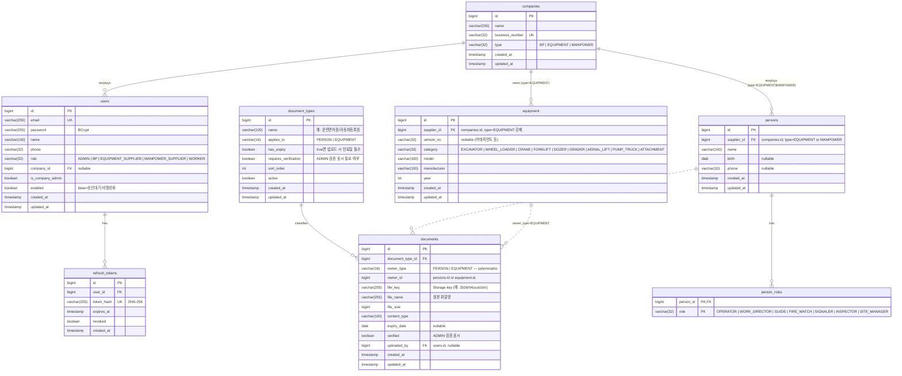
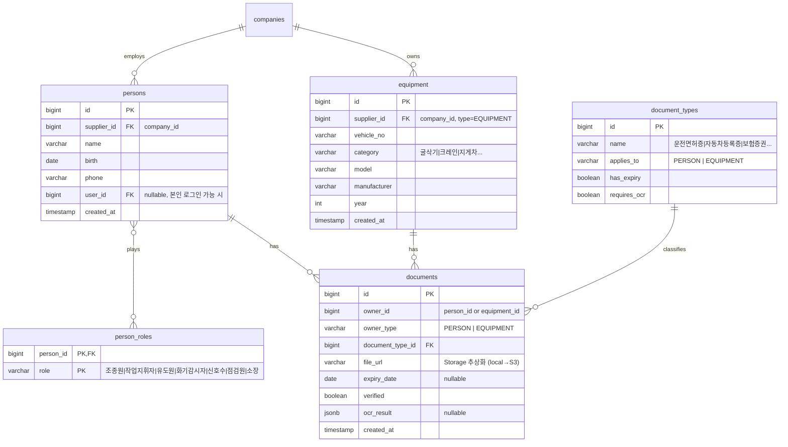

# SKEP v2 ERD

> 마지막 갱신: 2026-04-30 (Phase D-1 완료)
> 다이어그램은 Mermaid (GitHub에서 자동 렌더). 마이그레이션 SQL: `backend/src/main/resources/db/migration/`

---

## 현재 스키마 (Phase D-1까지)

### Role / CompanyType 매핑 (Person)
| PersonRole | 라벨 | 허용 supplier type |
|---|---|---|
| `OPERATOR` | 조종원 | EQUIPMENT |
| `WORK_DIRECTOR` | 작업지휘자 | MANPOWER |
| `GUIDE` | 유도원 | MANPOWER |
| `FIRE_WATCH` | 화기감시자 | MANPOWER |
| `SIGNALER` | 신호수 | MANPOWER |
| `INSPECTOR` | 점검원 | MANPOWER (잠정) |
| `SITE_MANAGER` | 소장 | MANPOWER (잠정) |

> 한 인원이 여러 role 가능 (다대다). EQUIPMENT 공급사는 OPERATOR만, MANPOWER 공급사는 그 외 6개. BP사는 인원 등록 불가.

### 관계
- `companies (1) ─── (0..N) users` — 한 회사에 여러 직원. ADMIN/WORKER는 company_id NULL 허용.
- `users (1) ─── (0..N) refresh_tokens` — 토큰 rotation 이력 + 활성 토큰. ON DELETE CASCADE.
- `companies (1) ─── (0..N) equipment` — type=EQUIPMENT 회사만 장비 보유 (서비스 레이어 검증). ON DELETE RESTRICT (장비 있는 회사 못 지움).

### Enum 값
- **Role**: `ADMIN`, `BP`, `EQUIPMENT_SUPPLIER`, `MANPOWER_SUPPLIER`, `WORKER`
- **CompanyType**: `BP`, `EQUIPMENT`, `MANPOWER`
- **매핑**: `BP↔BP`, `EQUIPMENT_SUPPLIER↔EQUIPMENT`, `MANPOWER_SUPPLIER↔MANPOWER`, `ADMIN/WORKER → 회사 없음`

### 마이그레이션
| 버전 | 파일 | 내용 |
|---|---|---|
| V1 | `V1__init_users.sql` | users + refresh_tokens |
| V2 | `V2__add_companies.sql` | companies + users.company_id FK |
| V3 | `V3__add_equipment.sql` | equipment + supplier_id FK to companies |
| V4 | `V4__add_persons.sql` | persons + person_roles (다대다) |
| V5 | `V5__add_documents.sql` | document_types(시드 12종) + documents (polymorphic owner) |

---

## Phase B+ 예정 스키마

> 점선은 아직 안 만든 테이블. 설계 의도 공유용.

### 설계 의도

**Person.role을 별도 테이블로 분리한 이유**
- 한 사람이 여러 역할 가능 (예: 조종원 + 신호수 둘 다)
- `persons.roles` 컬럼을 `varchar[]`로 둘 수도 있지만 마스터 테이블 + JOIN이 추후 통계/필터에 유리

**Document.owner를 polymorphic (owner_type + owner_id)으로 둔 이유**
- 사람 서류 / 장비 서류가 같은 흐름 (업로드 + 만료추적 + OCR)이라 테이블 통합이 효율적
- 단점: FK 제약 못 검. → 코드 레벨에서 검증 + DB CHECK 제약 추가 가능

**document_types를 마스터 테이블로**
- 새 서류 종류 추가 시 row 추가만으로 동작 (운영 중 추가 가능)
- has_expiry, requires_ocr 같은 메타로 UI/검증 분기

**file_url은 Storage 추상화 결과**
- 지금: `local:///app/uploads/{path}` 형태
- 나중: `s3://bucket/key`. URL만 갈아끼우면 끝

---

## 변경 이력

- 2026-04-30: 초안 작성. Phase A 스키마 (users, refresh_tokens, companies). Phase B+ 설계 윤곽.
- 2026-04-30: Phase B — equipment 테이블 추가.
- 2026-04-30: Phase C — persons + person_roles 테이블 추가, role-supplier type 매핑.
- 2026-04-30: Phase D-1 — document_types(seed 12종) + documents (polymorphic PERSON/EQUIPMENT). 파일은 LocalDiskStorage(/app/uploads, docker volume).
